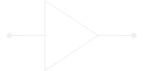
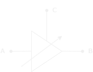

---

layout: ../../../layouts/MarkdownLayout.astro
title: Attenuators
---

import PlotWindow from '../../../components/PlotWindow.astro';

# What is an RF Amplifier

---

RF amplifiers are *active components* whose main function is to increase
the power of a signal; The opposite intent of an <a href="/RF_Components/Attenuators/Attenuators">RF Attenuator</a>.

    <PlotWindow amplitude="20"></PlotWindow>
    

        
    

    <PlotWindow amplitude="65"></PlotWindow>

## Gain

---

[Insert Gain Definition]

## Fixed Amplifiers

---

The most basic RF amplifier is a fixed amplifier. These amplifiers increase 
the power of a signal by a fixed amount.

  
  *Fixed RF Amplifier Symbol*

## Variable Amplifiers

---

Varibale amplifiers on the other hand, allow for a continuous variable 
amplification of a signal.

  
  *Variable RF Amplifier Symbol*

There are many different applications for variable amplifiers, one of which
is in the construction of an *Automatic Gain Controller (AGC)*.

### Variable Gain Amplifier (VGA)

A VGA is a voltage dependent amplifier; its amplification is dependent on an 
analog voltage control signal. These amplifiers are usually implemented in 
*AGCs*, calibration corrections, and other processing functions where smooth 
and precise control of a signal is required.

## Low Noise Amplifier (LNA)

The primary characteristic of an LNA is its *noise figure*, which is a
measure of how much the LNA degrades the signal-to-noise ratio of the
received signal. Other important characteristics of an LNA are its
linearity (measured in P1dB or third order intercept), and its survivable
power, its DC dissipation (particularly important in battery-power wireless
devices, and satellite systems).

## Links / Resources

---

-