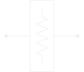
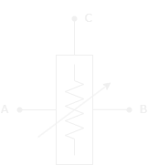
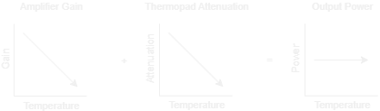
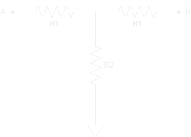
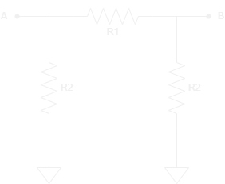

import { Icon } from 'astro-icon'
import { Notification } from 'accessible-astro-components'
import PlotWindow from '../../../components/PlotWindow.astro';

# What is an RF Attenuator

---

RF attenuators are components whose main function is to reduce the power of a
signal; The opposite intent of an <a href="/RF_Components/Amplifiers/Amplifiers">RF Amplifier</a>.

    <PlotWindow></PlotWindow>
    

        
    

    <PlotWindow></PlotWindow>

<Notification type="info">
  <Icon pack="ion" name="information-circle-outline" />
  

    A useful side effect of attenuators, is an improved impedance match between
    devices. This is often heavily taken advantage of, especially in high frequency
    circuits and between sensitive components.
  

  <Icon pack="ion" name="information-circle-outline" />
</Notification>

## Attenuation

---

[Insert Attenuation definition]

## Fixed Attenuator

---

The most basic RF attenuator is a fixed attenuator. These attenuators reduce 
the power of a signal by a fixed amount, and they generally rely on purely 
*passive components* to accomplish this.

*Fixed RF Attenuator Symbol*

## Variable Attenuator

---

Varibale attenuators on the other hand, are usually *active components* that 
allow for a continuous variable attenuation of a signal. Although variable
passive attenuators exist, they generally rely on external mechanical user 
control and are thus unsuitable for most applications.

*Variable RF Attenuator Symbol*

There are many different applications for variable attenuators, one of which
is in the construction of an *Automatic Gain Controller (AGC)*.

### Voltage Variable Attenuator (VVA)

As the name implies, a VVA is a voltage dependent attenuator; its attenuation
is dependent on an analog voltage control signal. These attenuators are usually
implemented in *AGCs*, calibration corrections, and other processing functions
where smooth and precise control of a signal is required.

### Digital Step Attenuator (DSA)

DSAs are essentially the digital equivalent of a VVA; their attenuation is
dependent on one or more digital control signals. They feature a set of
discrete attenuation levels referred to as the attenuation step size.

These attenuators provide a simple control interface that is directly
compatible with microcontrollers and *FPGAs*.

### Thermo-Variable Attenuator

A thermo-variable attenuator (generally referred to as a thermopad®) is a 
temperature dependent attenuator; its attenuation varies linearly with temperature. 

These attenuators have a nominal attenuation value with a temperature dependent
term added on top. So you can have a 3 dB attenuator with a +0.001 [dB/dB/°C] 
temperature dependence.

These two terms multiply together to get the real temperature compensation 
value. For the example, the 3 dB attenuator has a +0.003 [dB/°C] slope.

This slope can be positive or negative, although it is usually negative.
This is because these attenuators are most often used to compensate for 
the negative temperature gain slope of an amplifier.

*Simple Temperature Compensation of an Amplifier*

Although this is a simple example, it may be confusing. An amplifier generally
loses gain as temperature increases, which means that less attenuation is needed
to produce a constant output power.

## Construction

---

There are many ways to go about making an attenuator, but the most common
approaches are derivations of the *[Bias T]* and *[Pi (π) attenuators]*.

|                                                               |                                                       |
|:-------------------------------------------------------------:|:-----------------------------------------------------:|
|  *Bias T Attenuator* |  *Pi Attenuator* |

## Links / Resources

---

- https://www.analog.com/en/analog-dialogue/raqs/raq-issue-204.html	
- https://www.electronics-notes.com/articles/radio/rf-attenuators/pi-t-resistive-attenuator-pad-circuit-design-formula.php
- https://www.electronics-tutorials.ws/attenuators/attenuator.html
- https://www.electronics-notes.com/articles/radio/rf-attenuators/pi-t-resistive-attenuator-pad-circuit-design-formula.php
- https://www.everythingrf.com/rf-calculators/pi-attenuator-calculator
- https://www.minicircuits.com/appdoc/AN70-001.html