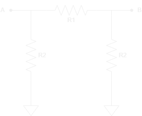
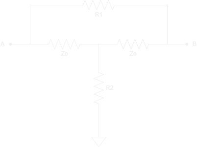

---

layout: ../../../layouts/MarkdownLayout.astro
title: Attenuator Construction
--- 

# Bias T Attenuator

---

The bias-T attenuator consists of three resistors in the shape of a T.

*Bias T Attenuator Circuit*

Input Variables:
- Desired attenuation (A [dB])
- Circuit impedance (Zo [Ω])

Output Variables:
- N = 10^(A/20)
- R1 [Ω]
  - Zo * [(N - 1) / N + 1]
- R2 [Ω]
  - Zo * [(2 * N) / (N ^ 2 - 1)]

# Pi Attenuator

---

The Pi attenuator consists of three resistors in the shape of π.

*Pi Attenuator Circuit*

Input Variables:
- Desired attenuation (A [dB])
- Circuit impedance (Zo [Ω])

Output Variables:
- N = 10^(A/20)
- R1 [Ω]
  - Zo * [(N ^ 2 - 1) / (2 * N)]
- R2 [Ω]
  - Zo * [(N + 1) / N - 1]

# Bridged T-Network Attenuator

---

The bridge T Network attenuator consists of four resistors.

*Bridged T Network Attenuator Circuit*

Input Variables:
- Desired attenuation (A [dB])
- Circuit impedance (Zo [Ω])

Output Variables:
- N = 10^(A/20)
- R1 [Ω]
  - Zo * (N - 1)
- R2 [Ω]
  - Zo / (N - 1)

# Links / Resources

---

- https://www.analog.com/en/analog-dialogue/raqs/raq-issue-204.html	
- https://www.electronics-notes.com/articles/radio/rf-attenuators/pi-t-resistive-attenuator-pad-circuit-design-formula.php
- https://www.electronics-tutorials.ws/attenuators/attenuator.html
- https://www.electronics-notes.com/articles/radio/rf-attenuators/pi-t-resistive-attenuator-pad-circuit-design-formula.php
- https://www.everythingrf.com/rf-calculators/pi-attenuator-calculator