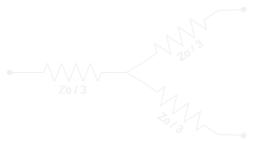
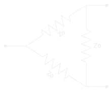

import PlotWindow from '../../../components/PlotWindow.astro';

# What is an RF Power Divider

---

Also known as a power combiner, this *passive component* can either split or combine signals.

    <PlotWindow></PlotWindow>
    
    <PlotWindow amplitude="32"></PlotWindow>

    <PlotWindow amplitude="32"></PlotWindow>

# 2:1 Power Dividers

---

The simplest form of an RF power divider is the 2:1 (or 1:2) combiner. As you
can guess, this takes 2 signals and combines it into 1, or it takes 1 signal 
and splits it into 2.

*Fixed RF Amplifier Symbol*

Two of the most common types of resistive power dividers are the
[wye] and [delta splitters].

|           Wye Splitter            |            Delta Splitter             |
|:---------------------------------:|:-------------------------------------:|
|  |  | 

# N-Way Power Dividers

Power dividers can have any number of ports in an N:1 or 1:N configuration. Even
the wye and delta splitters can be extended to N splits.

When splitting a signal, the power of the outputs is nominally 1 / N the power of
the input. This translates to a nominal 3 dB *loss* in a 2:1 power divider.

| Number of Outputs | Nominal Loss [dB] |
|:-----------------:|:-----------------:|
|         2         |       -3.01       |
|         3         |       -4.77       |
|         4         |       -6.02       |
|         5         |       -6.99       |
|         6         |       -7.78       |

# Links / Resources

---

-