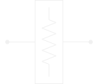

import PlotWindow from '../../components/PlotWindow.astro';
import Feature from '../../components/Feature.astro';

# What is a Component

---

An essential building block for RF designs

## 1 Port Components

---

    
    <PlotWindow amplitude="65"></PlotWindow>

    <a href="/RF_Components/Oscillators/Oscillators/"><Feature title="Oscillators">Creates a signal</Feature></a>

## 2 Port Components

---

    <PlotWindow num_waves="4"></PlotWindow>
    
    <PlotWindow amplitude="65"></PlotWindow>

    <a href="/RF_Components/Attenuators/Attenuators/"><Feature title="Attenuators">Reduces signal power</Feature></a>
    <a href="/RF_Components/Amplifiers/Amplifiers/"><Feature title="Amplifiers">Increases signal power</Feature></a>
    <a href="/RF_Components/Power_Detectors/Power_Detectors/"><Feature title="Power_Detectors">Converts signal power to voltage</Feature></a>

## 3 Port Components

---

    <PlotWindow num_waves="4"></PlotWindow>
    
    <PlotWindow amplitude="65"></PlotWindow>

    <PlotWindow amplitude="65"></PlotWindow>

    <a href="/RF_Components/Couplers/Couplers/"><Feature title="Couplers">Siphons signal power</Feature></a>
    <a href="/RF_Components/Mixers/Mixers/"><Feature title="Mixers">Multiplies signals</Feature></a>
    <a href="/RF_Components/Switches/Switches/"><Feature title="Switches">Changes RF path</Feature></a>
    <a href="/RF_Components/Power_Dividers/Power_Dividers/"><Feature title="Power Dividers">Splits signal in two</Feature></a>

