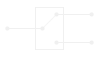
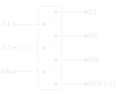

import PlotWindow from '../../../components/PlotWindow.astro';

# What is an RF Switch

---

An RF switch is an *active component* that can alter the path of an RF signal.

    <PlotWindow></PlotWindow>
    
    <PlotWindow></PlotWindow>

    <PlotWindow amplitude="3"></PlotWindow>

## Single Pole, Double Throw (SPDT)

---

The simplest form of an RF switch is the SPDT switch. Normally it would be a
Single Pole Single Throw (SPST) switch, but the signal should almost always go
somewhere.

*SPDT Symbol*

## MPMT Switches

---

*Multi Throw, Multi Pole Symbol*

## Links / Resources

---

- some links

- (Bi / Dual) - Directional
