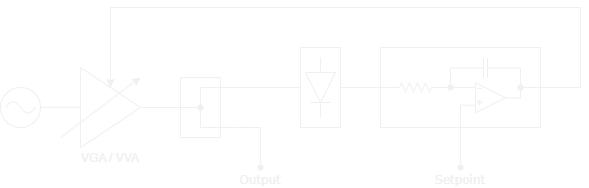

import PlotWindow from '../../../components/PlotWindow.astro';

# What is an Automatic Gain Controller

---

An Automatic Gain Controller (AGC) is a control circuit composed of a variable 
*attenuator* or *amplifier*, a *power detector*, and a control loop mechanism such
as a *PID controller*.

    <PlotWindow amplitude="20"></PlotWindow>
    

        
    

    <PlotWindow amplitude="65"></PlotWindow>

## Basic AGC

---

*Automatic Gain Controller Circuit*

# Links / Resources

---

-